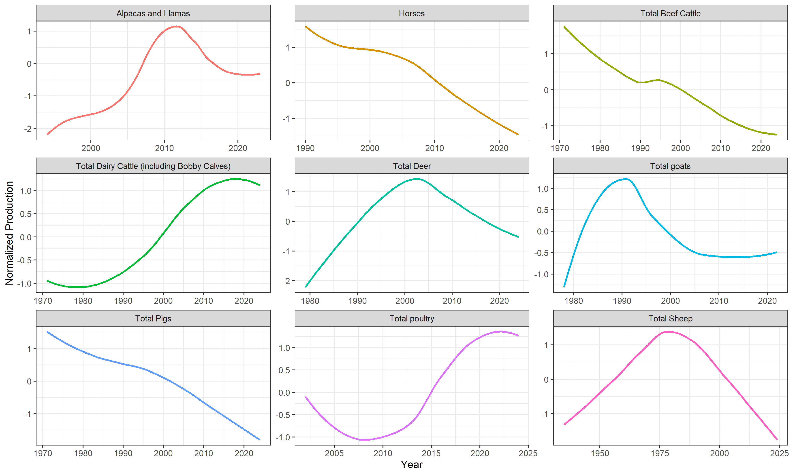

```{r setup, include=FALSE}
knitr::opts_chunk$set(echo = TRUE, message = F, warning = F)
```

This document show visualizations made for TidyTuesday of [2026-02-17](https://github.com/rfordatascience/tidytuesday/tree/main/data/2026/2026-02-17). 

Packages used for visualization: 
- `tidyverse`
- `ggthemes`
- `scales`

[View the complete R code here](https://github.com/more-mm/tidytuesday/blob/main/2026-02-17/stats_NZ.R) 

>This week we are exploring [agriculture production statistics in New Zealand](https://figure.nz/table/TSQ8lkuKnyzfERF3) using data compiled from 
from [StatsNZ](https://datainfoplus.stats.govt.nz/item/nz.govt.stats/eb7208cf-2f0f-416a-bd77-2fdbb9043255?_ga=2.264735308.2106648024.1715287902-1399521469.1678132138). 


Let's glance at the data.
```{r import}
dataset <- readr::read_csv('https://raw.githubusercontent.com/rfordatascience/tidytuesday/main/data/2026/2026-02-17/dataset.csv')
knitr::kable(head(dataset))
```


>Sheep have long outnumbered people in New Zealand, but the [ratio of sheep to people peaked in the 1980s and has been in steady decline](https://www.rnz.co.nz/news/country/560252/gap-between-people-and-sheep-rapidly-closing)


> The gap between people and sheep in New Zealand is rapidly closing. There's now about 4.5 sheep to every person in New Zealand compared to a peak of 22 sheep per person in the 1980s, that's according to figures released by Stats NZ this week.

>Is sheep production unique in its decline? Do other types of meat production show the same pattern?

Horse, beef cattle, deer, and pig production have all shown consistently decreasing values over the last few decades, mirroring the downward trend seen in sheep.




>Which agricultural industries have shown the most production growth?

To answer this question, we computed the Compound Annual Growth Rate (CAGR). This metric represents the steady, constant rate at which a value would have grown if it had increased evenly each year, allowing us to summarize the long-term growth trend of each production category into a single, comparable statistic. CAGR is calculated as  $$CAGR=\left(\frac{End\_Value}{Start\_Value}\right)^{\frac{1}{n}}-1$$ where $n$ is the number of years spanned from the beginning of the production.


